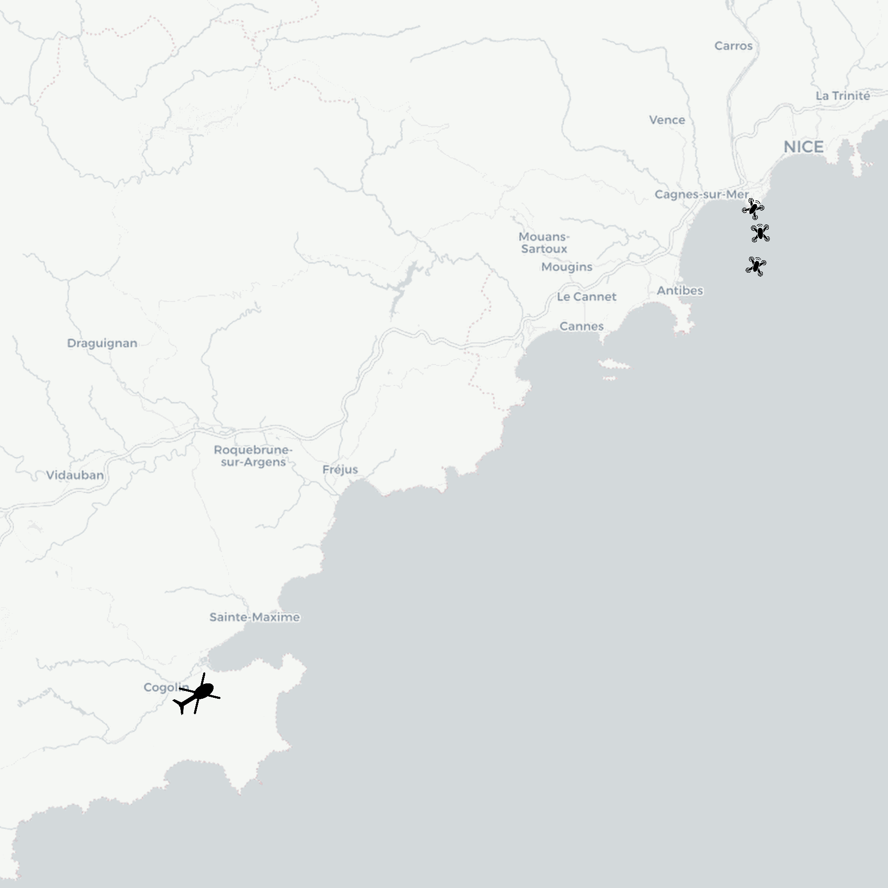

# Short script in Python to create animated gif or mp4 from a folder of images. 
 

Example: animated gif from png images located in my_img_folder

 

## Running the tests

Run the notebook demo_animation.ipynb

## Install
conda install conda-forge::imageio

pip install imageio[ffmpeg]

## Authors
* **Thomas Dubot** 

## License
This project is licensed under the MIT License - see the [LICENSE.md](LICENSE.md) file for details
